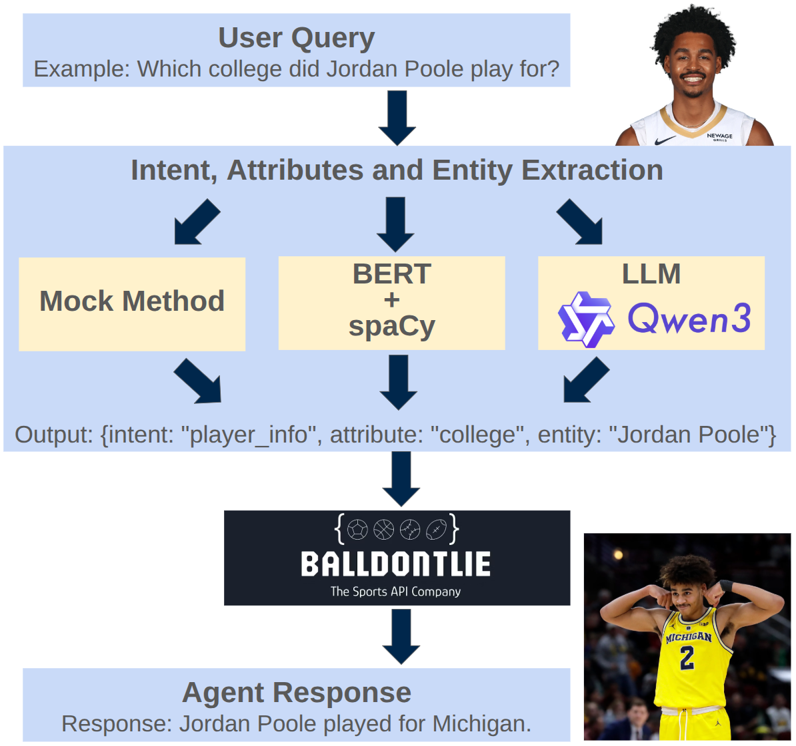

# NBA-AI-Agent

An AI agent that understands natural-language NBA questions and fetches answers from the Ball Don't Lie API.



## 📋 Overview

The system implements three NLU methods for intent classification and slot filling:

1. **Mock Method** – Rule-based predictor using keyword matching
2. **BERT Method** – Fine-tuned BERT model with spaCy for entity extraction
3. **LLM Method** – Zero-shot Qwen3-4B-Instruct model

All methods integrate with the Ball Don't Lie API to retrieve and format responses.

## 🏗️ Project Structure

```
code/
├── bert/                      # BERT model training and inference
│   ├── train_bert.py          # Model training
│   ├── bert.py                # BERT predictor
│   ├── preprocess_data.py     # Dataset preprocessing
│   ├── test_bert.py           # BERT evaluation
│   └── test_API_with_bert.py  # End-to-end with BERT
│
├── LLM/                       # LLM-based predictor
│   ├── llm_predictor.py        # Qwen3 predictor
│   ├── test_llm.py            # LLM evaluation
│   └── test_API_with_llm.py  # End-to-end with LLM
│
├── mock/                      # Mock/testing components
│   ├── mock_predictor.py      # Rule-based predictor
│   ├── test_mock.py           # Mock evaluation
│   ├── test_api_with_mock.py  # End-to-end with mock
│   └── compare_mock_vs_trained.py
│
├── API/                       # API integration components
│   ├── api_service.py         # Wrapper for Ball Don't Lie API
│   ├── entity_linker.py       # Name → ID entity linking
│   ├── api_router.py          # Maps intents/slots to API calls
│   ├── response_formatter.py  # Natural-language responses
│   ├── test_api_service.py
│   ├── test_entity_linker.py
│   └── test_api_router.py
│
└── end_to_end.py              # Full pipeline orchestration
```

## 🚀 Getting Started

### Prerequisites

1. Install dependencies:
```bash
pip install torch transformers scikit-learn balldontlie spacy
python -m spacy download en_core_web_trf
```

2. Configure your API key:
   - Create `code/API/API_KEY.txt`
   - Paste your Ball Don't Lie API key inside

### Option 1: Using BERT

Train:
```bash
cd code/bert
python train_bert.py
```

Test:
```bash
cd code/bert
python test_API_with_bert.py
```

### Option 2: Using LLM

Test:
```bash
cd code/LLM
python test_API_with_llm.py
```

### Option 3: Using Mock Predictor

Test:
```bash
cd code/mock
python test_api_with_mock.py
```